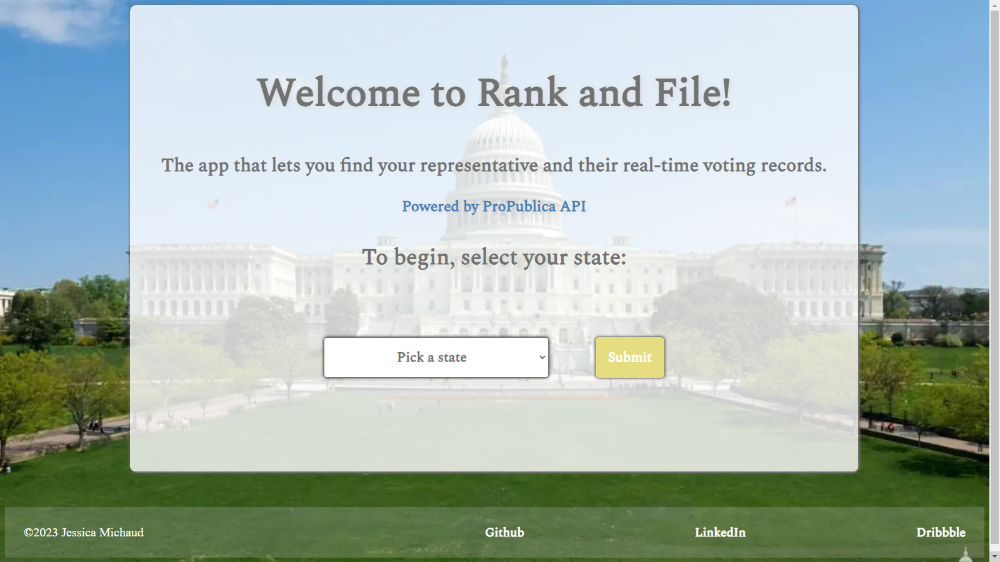
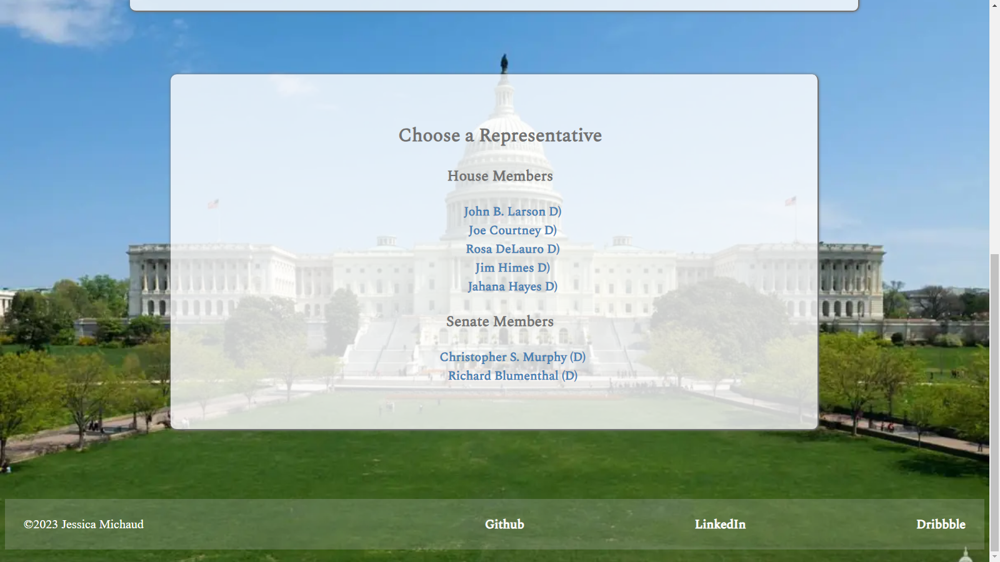
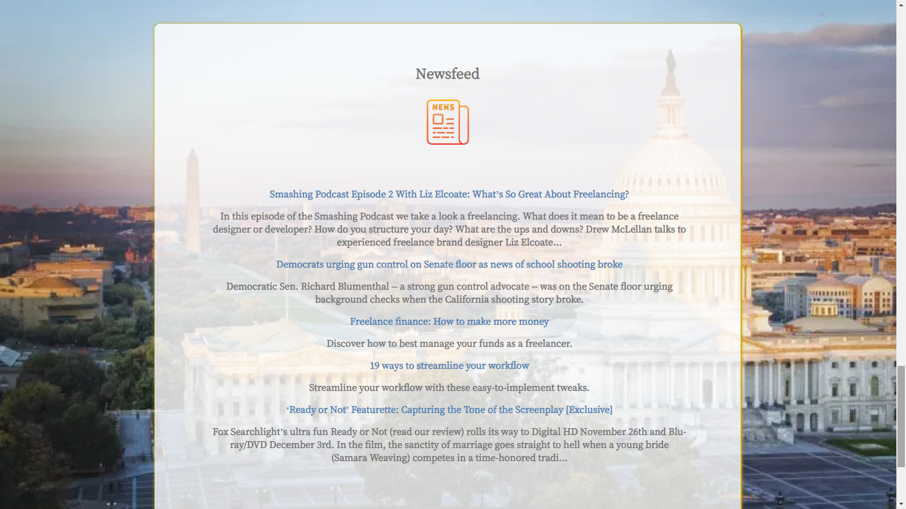

<h1>R A N K  A N D  F I L E</h1>

<h2>APPLICATION WEBSITE</h2>

A working prototype of this app can be viewed at <a href="https://jessmichaud488.github.io/RankandFile/">https://jessmichaud488.github.io/RankandFile/</a>

<h2>USE CASE</h2>

A political app with the aim to give voters a transparent look at the representatives of their state. The user of this app will be able to view the contact information, leadership roles, voting information, and latest news stories from a myriad of news sources of their state's current congressmen.

<h2>HOW IT WORKS</h2>

The user of this app will be able to view the contact information, leadership roles, voting information, and latest news stories from a myriad of news sources of their state's current congressmen.

<h2>FUNCTIONALITY</h2>

This app's functionality includes:

<ul>
<li>Searching by state via a dropdown menu for their federal level representatives</li>
<li>Selecting a specific politician and viewing contact and committee member information</li>
<li>View a newsfeed with reports specific to that politician</li>
</ul>

<h2>TECHNOLOGY</h2>
<h3>Front End</h3>
<ul>
	<li>HTML</li>
	<li>CSS</li>
	<li>JavaScript</li>
	<li>jQuery</li>
</ul>

<h3>APIs</h3>
<ul>
	<li>Propublica (https://projects.propublica.org/)</li>
	<li>News API (https://newsapi.org)</li>
</ul>